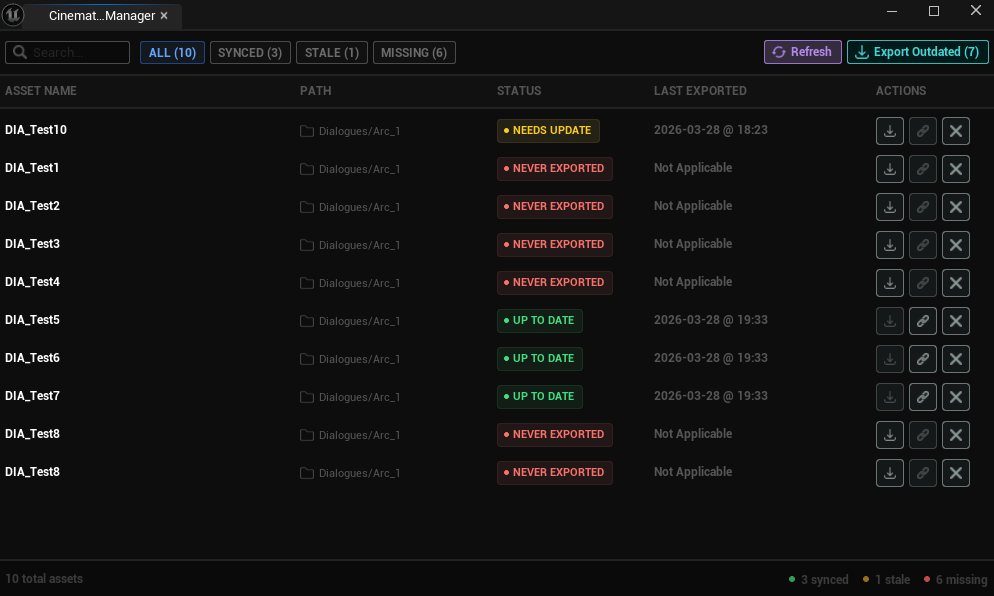
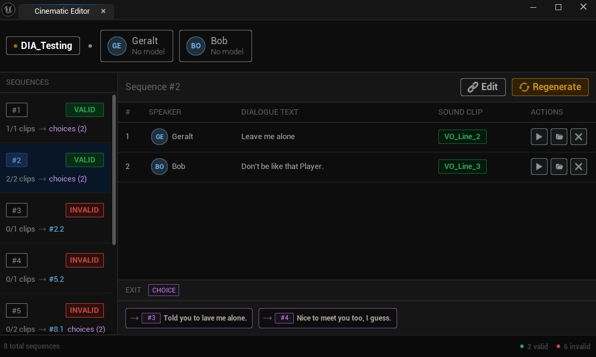

# Cinematic Timeline

**Cinematic Timeline** is a runtime extension for the **Dialogue System**. It allows you to bind **voiceovers** and **character models** to existing Dialogue Graphs, then automatically generate a runtime actor that plays through the sequence according to the dialogue's logic.

## How To Use

### Manage dialogues

1. Open the **Cinematic Timeline Manager**
2. Export the Dialogue Graphs you want to use as cinematic sequences
3. Click on the link icon of an exported dialogue to open it in the **Dialogue Timeline Editor**

> To learn about Dialogue Graph creation, refer to the [Dialogue System Documentation](../Docs/DialogueSystem.md).

### Set up a particular dialogue

1. Assign character models to dialogue participants

> To learn about characters and their models, refer to the [Character System Documentation](../Docs/CharacterSystem.md).

2. Assign voiceovers to individual lines - only sound assets prefixed with **VO_** will be available
3. Use the navigation buttons to follow the dialogue flow and verify the setup

### Use in runtime

Once a dialogue is fully set up, a runtime actor is generated automatically.

The naming follows a fixed convention — if the source Dialogue Asset was named **DIA_EntrySpeech**, the generated runtime actor will be named **CIN_EntrySpeech**.

To use it:

1. Add the **CIN_** actor to your scene
2. By default it plays on **Begin Play** - this can be changed in `/Chronicle/Actors/BP_CinematicSequenceActor`

## Integration

The Cinematic Timeline is still a work in progress and is **not recommended for production use** yet. The current runtime integration is intentionally minimal and serves primarily as a showcase.

What's still needed:
- More flexible playback control
- Improved runtime actor configuration
- Better integration with the broader Chronicle systems
